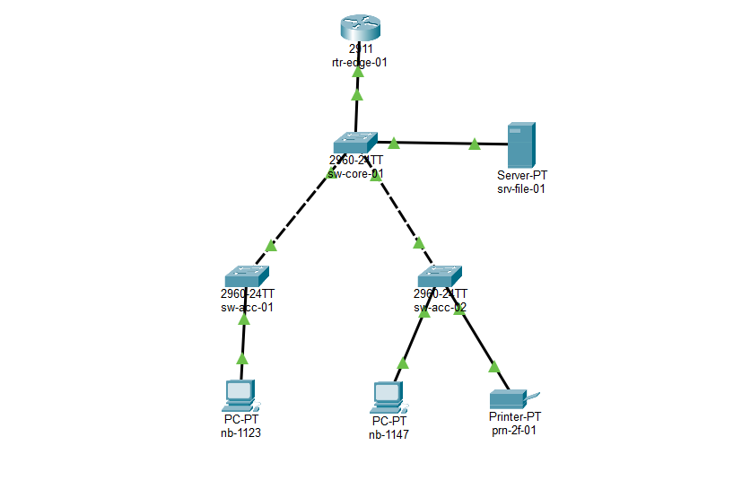
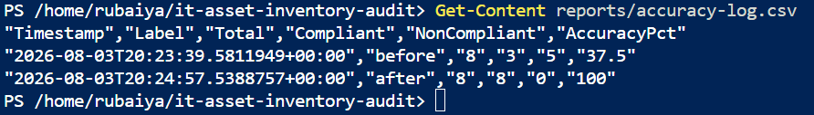
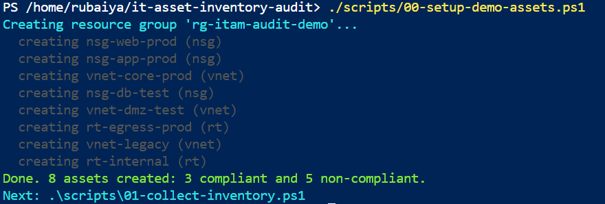
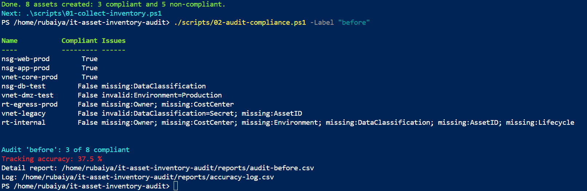
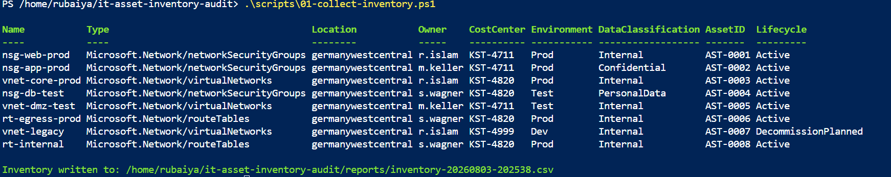
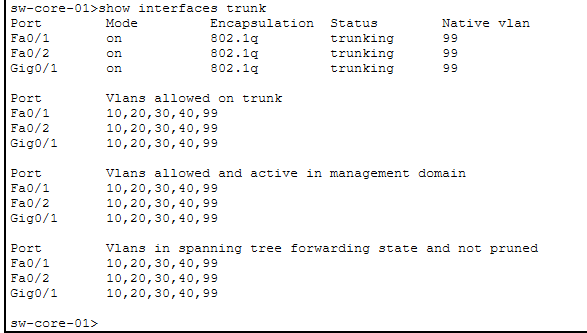
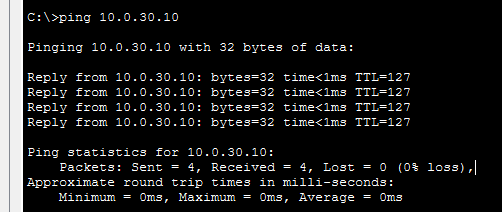
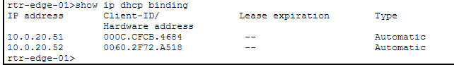

# 🗂️ azure-itam-compliance

**IT asset management and compliance auditing across two domains: Azure cloud resources and a physical hardware and network estate.**



*The LAN behind the CMDB. Eight devices, seven links, five VLANs, built and verified in Packet Tracer. Every device maps to an AssetID in [`data/hardware-inventory.csv`](data/hardware-inventory.csv). The lab file is [`network/koeln-hq-lan.pkt`](network/koeln-hq-lan.pkt), open it yourself.*

Both modules use the same audit pattern. Inventory the assets, check each one against a written policy, report what is non-compliant, fix it, and measure tracking accuracy again. Every run appends to one shared log.

## 📊 Results

| Module | Assets | Before | After | Evidence |
|--------|--------|--------|-------|----------|
| ☁️ Cloud | 8 | 3/8 = **37.5%** | 8/8 = **100%** | [`reports/accuracy-log.csv`](reports/accuracy-log.csv) |
| 🌐 Hardware | 15 | 9/15 = **60%** | 15/15 = **100%** | [`reports/accuracy-log.csv`](reports/accuracy-log.csv) |

Both measured, not projected. Cloud ran in Azure Cloud Shell against a live subscription in Germany West Central. Hardware ran locally.



## 🧭 Where everything is

| I want to see... | Go to |
|---|---|
| 📐 The network design: VLANs, IP scheme, Wi-Fi, diagram | [`docs/network-topology.md`](docs/network-topology.md) |
| 🧪 How I built the lab, step by step, with the mistakes | [`docs/lab-build.md`](docs/lab-build.md) |
| 🔧 Every problem I hit and how it was solved | [`docs/TROUBLESHOOTING.md`](docs/TROUBLESHOOTING.md) |
| 🔌 The lab, configs and verification captures | [`network/README.md`](network/README.md) |
| 💾 The Packet Tracer file itself | [`network/koeln-hq-lan.pkt`](network/koeln-hq-lan.pkt) |
| ⚙️ Real device configs exported from the lab | [`network/configs/`](network/configs/) |
| 📸 Ten verification screenshots | [`network/screenshots/`](network/screenshots/) |
| 📋 The cloud asset policy | [`config/tagging-standard.md`](config/tagging-standard.md) |
| 🖥️ The hardware inventory policy | [`config/hardware-inventory-standard.md`](config/hardware-inventory-standard.md) |
| 🗃️ The CMDB itself, 15 devices | [`data/hardware-inventory.csv`](data/hardware-inventory.csv) |
| 🤖 The automation | [`scripts/`](scripts/) |
| 🧾 Generated audit reports | [`reports/`](reports/) |
| 🛡️ Policy as code | [`policies/require-tracking-tags.policy.json`](policies/require-tracking-tags.policy.json) |

## 🚧 Status

- [x] ☁️ Module 1: Azure resource governance
- [x] 🌐 Module 2: Hardware and network CMDB
- [x] 📡 Network documentation and lab build
- [ ] 📶 Wi-Fi: WLAN controller and access points in the lab

---

## ☁️ Module 1: Azure resource governance

I keep the six tracking fields as tags on the resource itself, so the record travels with the asset instead of living in a spreadsheet that drifts. Full policy: [`config/tagging-standard.md`](config/tagging-standard.md).

Everything runs in PowerShell. The Az module and a login are assumed.

```powershell
# one time
Install-Module Az -Scope CurrentUser        # if not already installed
Connect-AzAccount
Set-AzContext -Subscription "<your-subscription-id>"

# 1. create demo assets with intentionally messy tags
.\scripts\00-setup-demo-assets.ps1

# 2. pull the inventory
.\scripts\01-collect-inventory.ps1

# 3. audit BEFORE the fix  ->  note the accuracy
.\scripts\02-audit-compliance.ps1 -Label "before"

# 4. fix the tags / reconcile the assets
.\scripts\03-remediate-tags.ps1

# 5. audit AFTER the fix  ->  note the accuracy
.\scripts\02-audit-compliance.ps1 -Label "after"

# 6. optional: assign the Azure Policy (audit effect)
.\scripts\05-assign-policy.ps1

# 7. clean up so nothing costs money
.\scripts\04-teardown.ps1
```

In Azure Cloud Shell use forward slashes (`./scripts/...`) and pick PowerShell, not Bash. See [`docs/TROUBLESHOOTING.md`](docs/TROUBLESHOOTING.md).

[`00-setup-demo-assets.ps1`](scripts/00-setup-demo-assets.ps1) builds a deliberately broken estate: eight resources, three tagged correctly and five with real faults. Starting from a clean estate would prove nothing, so I seed the kind of drift that actually happens.



### 🔍 The audit finding all five faults



`vnet-dmz-test` is the line worth reading twice. `Environment=Production` is **present**, so a check that only asked whether the field was populated would have passed it. It fails because the standard allows `Prod`, `Test`, `Dev` and nothing else.

That is the difference between a completeness check and a compliance audit.

Findings are typed (`missing:Owner`, `invalid:Environment=Production`) rather than a bare pass or fail, because whoever picks up the report needs to know what to fix.

<details>
<summary>📄 The inventory after remediation, all eight fully tagged</summary>



</details>

The resource types used are NSG, VNet and route table. All free, so the lab can be rebuilt as often as needed.

### 🛡️ Policy as code

[`policies/require-tracking-tags.policy.json`](policies/require-tracking-tags.policy.json) expresses the same standard as an Azure Policy definition. The audit script is a point-in-time check I have to remember to run; the policy hands the rules to the platform so violations get flagged continuously, including on resources created after the audit.

The effect is `audit`, not `deny`. Deny is the right end state but the wrong opening move: switch it on before knowing what it catches and you block deployments on day one.

---

## 🌐 Module 2: Hardware and network inventory

No cloud login and no Az module, because most asset management work is physical. Rules: [`config/hardware-inventory-standard.md`](config/hardware-inventory-standard.md). Data: [`data/hardware-inventory.csv`](data/hardware-inventory.csv).

```powershell
# 1. audit the CMDB BEFORE the fix  ->  note the accuracy
.\scripts\10-audit-hardware.ps1 -CsvPath data\hardware-inventory.csv -Label "hardware-before"

# 2. reconcile the broken records (writes a clean copy)
.\scripts\11-remediate-hardware.ps1

# 3. audit AFTER the fix  ->  note the accuracy
.\scripts\10-audit-hardware.ps1 -CsvPath data\hardware-inventory-clean.csv -Label "hardware-after"
```

The CMDB holds 15 devices: a core switch, two access switches, an edge router, a perimeter firewall, a WLAN controller, three access points, a file server, two laptops and a printer.

Six records are broken on purpose, each a fault I would expect to actually find:

| Asset | Fault |
|---|---|
| `AST-1010` | access point in reception with no owner |
| `AST-1011` | laptop with no warranty end date |
| `AST-1012` | access switch recorded as `10.0.10.300`, not a valid address |
| `AST-1013` | laptop on VLAN 25, which is not in the plan |
| `AST-1014` | printer with no cost center |
| `AST-1015` | access point with no VLAN at all |

### 🔍 The network checks

Beyond required fields, [`10-audit-hardware.ps1`](scripts/10-audit-hardware.ps1) does three things a generic spreadsheet validator would miss.

IPv4 is parsed octet by octet rather than pattern matched, so `10.0.10.300` is caught as out of range instead of slipping past a loose regex. VLAN is checked against the actual plan, so a device on VLAN 25 is a finding even though 25 is a perfectly legal VLAN number in general. MAC is optional, but a malformed one still fails, because a half-typed MAC is worse than an empty field.

### 🔁 Why reconciliation writes a new file

[`11-remediate-hardware.ps1`](scripts/11-remediate-hardware.ps1) keys corrections by AssetID and writes a clean copy rather than editing the seed in place.

The before state has to stay reproducible, otherwise the 60% cannot be re-measured by anyone checking my work. And a script that rewrites the source inventory on every run is how one bad assumption becomes a permanently corrupted CMDB.

---

## 📡 The network behind the CMDB

The hardware module would be a spreadsheet exercise if the devices in it were invented. They are not.

Full design in [`docs/network-topology.md`](docs/network-topology.md), build steps in [`docs/lab-build.md`](docs/lab-build.md), exported configs in [`network/configs/`](network/configs/), evidence index in [`network/README.md`](network/README.md).

| VLAN | Name | Use | Subnet | Gateway |
|------|------|-----|--------|---------|
| 10 | MGMT | switches, router, APs, controller | 10.0.10.0/24 | 10.0.10.1 |
| 20 | CLIENTS | laptops, printers | 10.0.20.0/24 | 10.0.20.1 |
| 30 | SERVERS | file and app servers | 10.0.30.0/24 | 10.0.30.1 |
| 40 | WIFI | wireless clients | 10.0.40.0/24 | 10.0.40.1 |
| 99 | NATIVE | trunk native and parking | not routed | none |

Switch-to-switch and switch-to-router links are 802.1Q trunks with an explicit allowed VLAN list and 99 as native:



### 🎯 How I know it actually routes



Look at the TTL.

| Ping from `nb-1123` | TTL | Meaning |
|---|---|---|
| `10.0.20.1` gateway | 255 | the router answered directly |
| `10.0.20.52` other laptop | 128 | same VLAN, never routed |
| `10.0.20.80` printer | 128 | same VLAN |
| `10.0.30.10` file server | **127** | **routed exactly once** |

Replies start at TTL 128 and every router that forwards one subtracts 1. A reply coming back at 127 is the packet itself reporting that exactly one router handled it.

That proves inter-VLAN routing without anyone having to trust my config or my diagram.

<details>
<summary>📸 All ten verification captures</summary>

| Capture | Proves |
|---|---|
| [`00-final-pkt-screenshot.png`](network/screenshots/00-final-pkt-screenshot.png) | Topology, every link green |
| [`01-ipconfig-nb-1123.png`](network/screenshots/01-ipconfig-nb-1123.png) | DHCP gave `10.0.20.51`, matching `AST-1011` |
| [`02-ping-gateway.png`](network/screenshots/02-ping-gateway.png) | Gateway reachable, TTL 255 |
| [`03-ping-server-cross-vlan.png`](network/screenshots/03-ping-server-cross-vlan.png) | 🎯 Inter-VLAN routing, TTL 127 |
| [`04-ping-across-access-switches.png`](network/screenshots/04-ping-across-access-switches.png) | Across the core to the other floor |
| [`05-ping-printer.png`](network/screenshots/05-ping-printer.png) | Printer at its static address |
| [`06-core-show-vlan-brief.png`](network/screenshots/06-core-show-vlan-brief.png) | Five VLANs, server port in VLAN 30 |
| [`07-core-show-interfaces-trunk.png`](network/screenshots/07-core-show-interfaces-trunk.png) | Three trunks, native 99 |
| [`08-router-show-ip-interface-brief.png`](network/screenshots/08-router-show-ip-interface-brief.png) | Five subinterfaces up |
| [`09-router-show-ip-dhcp-binding.png`](network/screenshots/09-router-show-ip-dhcp-binding.png) | Which MAC received which address |



The DHCP binding is the router's own record of what it leased. `10.0.20.51` and `10.0.20.52` went to the two laptops, matching `AST-1011` and `AST-1013` in the CMDB without my having touched anything.

</details>

### 🔍 What building it changed

The lab was not a formality. It found faults in configs that read correctly written down.

The printer was cabled to the first-floor switch when the CMDB puts it on the second. That is the kind of error no field-level audit can catch, because which switch a device hangs off is not a checked field.

The DHCP pool could hand out the printer's static `10.0.20.80`, since the pool covered the whole subnet and only excluded `.1` to `.50`. It would have worked perfectly until the day a new device joined.

Both are in the exported configs and both are written up in [`docs/lab-build.md`](docs/lab-build.md) as corrections rather than quietly fixed. More in [`docs/TROUBLESHOOTING.md`](docs/TROUBLESHOOTING.md).

---

## 🧾 Evidence

Every number above is backed by a generated file.

| File | What it holds |
|---|---|
| [`reports/accuracy-log.csv`](reports/accuracy-log.csv) | Every audit run, both modules, timestamped |
| [`reports/audit-before.csv`](reports/audit-before.csv) | Cloud, per-resource findings before remediation |
| [`reports/audit-after.csv`](reports/audit-after.csv) | Cloud, same eight resources after |
| [`reports/audit-hardware-before.csv`](reports/audit-hardware-before.csv) | Hardware, per-device findings before reconciliation |
| [`reports/audit-hardware-after.csv`](reports/audit-hardware-after.csv) | Hardware, same fifteen devices after |

```
"Timestamp","Label","Total","Compliant","NonCompliant","AccuracyPct"
"2026-08-03T20:23:39.5811949+00:00","before","8","3","5","37.5"
"2026-08-03T20:24:57.5388757+00:00","after","8","8","0","100"
"2026-08-04T02:35:18.1292292+06:00","hardware-before","15","9","6","60"
"2026-08-04T02:35:18.1965662+06:00","hardware-after","15","15","0","100"
```

The offsets differ, `+00:00` on the cloud rows and `+06:00` on the hardware rows, because those runs happened on two different machines. The log is append-only, so runs accumulate into one record instead of overwriting each other.

The detail reports are the more useful artifact. They do not just say five resources failed, they say which check each one failed and why:

```
"vnet-dmz-test","Microsoft.Network/virtualNetworks","False","invalid:Environment=Production"
"rt-internal","Microsoft.Network/routeTables","False","missing:Owner; missing:CostCenter; missing:Environment; missing:DataClassification; missing:AssetID; missing:Lifecycle"
```

---

## 📁 Repo map

```
config/
  tagging-standard.md                  cloud asset policy: required tags, values, cadence
  hardware-inventory-standard.md       hardware CMDB policy: required fields, valid values
data/
  hardware-inventory.csv               seed CMDB, 15 devices, 6 broken on purpose
scripts/
  00-setup-demo-assets.ps1             creates demo Azure resources with messy tags
  01-collect-inventory.ps1             cloud inventory as CSV
  02-audit-compliance.ps1              cloud audit, accuracy, log
  03-remediate-tags.ps1                fix the cloud tags
  04-teardown.ps1                      delete the resource group
  05-assign-policy.ps1                 assign the Azure Policy, read compliance
  10-audit-hardware.ps1                hardware audit, accuracy, log
  11-remediate-hardware.ps1            reconcile the CMDB, write clean copy
policies/
  require-tracking-tags.policy.json    Azure Policy definition, audit effect
docs/
  network-topology.md                  LAN, VLAN plan, IP scheme, Wi-Fi, diagram
  lab-build.md                         step by step build with real IOS, corrections marked
  TROUBLESHOOTING.md                   every problem actually hit
network/
  README.md                            index of the network evidence
  koeln-hq-lan.pkt                     the Packet Tracer lab itself
  configs/                             running-configs exported from the lab
  screenshots/                         ten verification captures
reports/                               generated audit reports and accuracy-log.csv
images/                                terminal captures from the cloud run
```

Both modules share six identical fields. That is why one audit engine works for cloud and physical alike, and why both write to the same accuracy log. Asset management is one discipline, not two.

---

## 📄 License

MIT. See [`LICENSE`](LICENSE).
