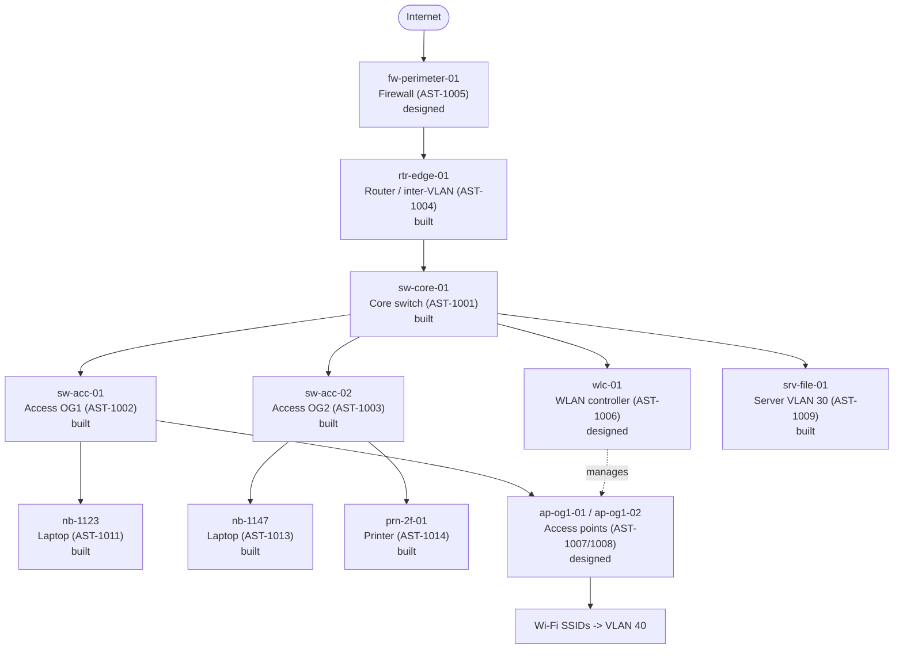

# 🌐 Network Topology

Site DE-KOELN-HQ. My small segmented LAN: a perimeter firewall, an edge router doing inter-VLAN routing, one core switch, access switches per floor, and Wi-Fi through a WLAN controller and access points.

Every device here maps to an AssetID in [`../data/hardware-inventory.csv`](../data/hardware-inventory.csv). That mapping is the point of the whole project. I want my inventory to describe a network that exists, not a list of plausible hostnames.

## 🏗️ What I built and what I only designed

I built the wired core in Packet Tracer and verified it end to end. My lab file is [`../network/koeln-hq-lan.pkt`](../network/koeln-hq-lan.pkt) and my captures are in [`../network/screenshots/`](../network/screenshots/).

| Part | Status |
|---|---|
| Edge router, inter-VLAN routing, DHCP | ✅ built and verified |
| Core switch, trunks to router and both access switches | ✅ built and verified |
| Two access switches, clients in VLAN 20 | ✅ built and verified |
| File server on VLAN 30, static | ✅ built and verified |
| Two laptops on DHCP, printer static | ✅ built and verified |
| Wi-Fi: WLAN controller and access points | 📐 designed, not yet built |
| Perimeter firewall | 📐 designed, not yet built |

I keep the unbuilt parts in my CMDB and in the diagram because they belong to the design. I mark them here rather than quietly implying I built them, so nobody has to guess which is which.

## 📊 Diagram



## 🔢 VLAN plan

| VLAN | Name | Use | Subnet | Gateway |
|------|------|-----|--------|---------|
| 10 | Management | switches, router, firewall, APs, controller | 10.0.10.0/24 | 10.0.10.1 |
| 20 | Clients | laptops, printers | 10.0.20.0/24 | 10.0.20.1 |
| 30 | Servers | file and app servers | 10.0.30.0/24 | 10.0.30.1 |
| 40 | Wi-Fi | wireless clients | 10.0.40.0/24 | 10.0.40.1 |
| 99 | Native | trunk native and parking | not routed | none |

Inter-VLAN routing lives on `rtr-edge-01`. Management VLAN 10 is reachable only from admin subnets.

VLAN 99 carries no devices on purpose. It is the native VLAN, so its traffic crosses trunks untagged, and giving untagged frames somewhere harmless to land is safer than letting them default into a VLAN that matters.

## 🔌 Port roles

- Uplinks between `sw-core-01` and the access switches are 802.1Q trunks carrying tagged VLANs 10, 20, 30, 40 with 99 as native.
- Client ports on access switches are untagged access ports in VLAN 20. I configure the whole block `Fa0/1` to `Fa0/10` rather than only the ports in use, so anyone can plug in anywhere on that floor.
- Access point uplinks are trunks: the AP management interface sits in VLAN 10, Wi-Fi client traffic is bridged to VLAN 40.

The trunks specify an allowed VLAN list rather than carrying everything. A trunk with no allowed list carries every VLAN that exists, now and in future, so a VLAN created by accident next year would silently start crossing links it was never meant to.

## 🗺️ Built layout

This is what is actually in the lab file, port for port.

```
                             rtr-edge-01
                              (AST-1004)
                                  | Gi0/0   trunk, native 99
                                  | Gi0/1
      srv-file-01 ————————————— sw-core-01
      (AST-1009)      Gi0/2      (AST-1001)
       VLAN 30                   /         \
                          Fa0/1 /           \ Fa0/2
                         trunk /             \ trunk
                         Gi0/1 |             | Gi0/1
                        sw-acc-01           sw-acc-02
                        (AST-1002)          (AST-1003)
                         OG1-IDF             OG2-IDF
                            |                /       \
                      Fa0/1 |          Fa0/1/         \ Fa0/2
                        nb-1123          nb-1147   prn-2f-01
                       (AST-1011)       (AST-1013) (AST-1014)
                        OG1-Buero        OG2-Buero  OG2-Flur
```

One device on the first-floor switch, two on the second-floor switch. That matches the `Room` column in the CMDB, which is not cosmetic: if the record says a printer is on the second floor and it is actually cabled to the first-floor switch, the inventory is wrong and no field-level audit would ever catch it.

## 📶 Wi-Fi

| SSID | Purpose | VLAN | Security |
|------|---------|------|----------|
| KOELN-CORP | staff devices | 40 | WPA2-Enterprise (802.1X) |
| KOELN-GUEST | visitors | 40 | WPA2-PSK, isolated |

The WLAN controller `wlc-01` manages the access points centrally: firmware, radio settings, and SSID to VLAN mapping. Centralised control is why the controller exists at all; without it each AP is configured and upgraded by hand.

## 🏷️ DHCP

Scopes run per VLAN on the router: clients in VLAN 20, Wi-Fi in VLAN 40. Network devices in VLAN 10 and servers in VLAN 30 use static addresses, which is why their IPs are tracked in the CMDB rather than discovered.

Anything statically assigned inside a DHCP range has to be excluded from that range:

```
ip dhcp excluded-address 10.0.20.1 10.0.20.50    reserved for infrastructure
ip dhcp excluded-address 10.0.40.1 10.0.40.20    reserved for Wi-Fi infrastructure
ip dhcp excluded-address 10.0.20.80              prn-2f-01, static
```

The third line was added after building the lab. The printer holds `10.0.20.80` statically, but the CLIENTS pool leases from the whole of `10.0.20.0/24`, so DHCP would have handed that address to a laptop eventually. It would have worked perfectly until the day a new device joined.

The exclusion range also decides the first address DHCP can offer. Excluding `.1` to `.50` means the first laptop gets `.51`, which is what `AST-1011` says in the CMDB. That is by design, not luck.

## 🔗 How this ties to the audit

`scripts/10-audit-hardware.ps1` checks that each device has a valid management IP and sits in an allowed VLAN. When the documentation and the real configuration drift apart, a switch with an out-of-plan VLAN or an address that cannot exist, the audit catches it and it counts against tracking accuracy.

Two of the seeded faults in the CMDB are exactly this kind of drift: `AST-1012` recorded as `10.0.10.300`, which is not a valid address, and `AST-1013` on VLAN 25, which is not in the plan above.
